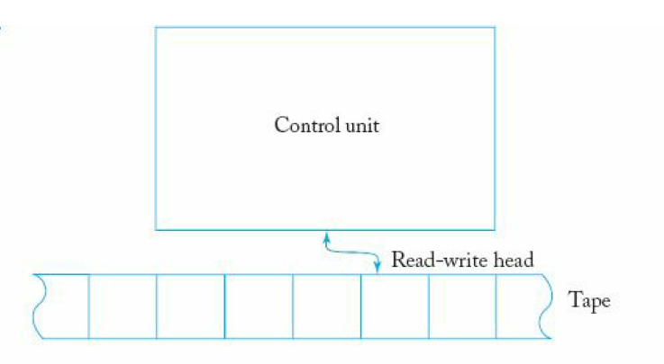

# TurinMachine

This is a very simple implementation of the Turing Machine.Executing the given commands, it helps testing Turing Machine's transition-functions and useful for educational purposes.  

## Model of the implemented machine



# Usage
1- Run the program.    
2- Input the transitions in the following format:  

```
q0,a = q1,b,L
q1-a = q2,x,R
```
both of '-' and ',' are ok!  

3- Enter your machine's final-states:  
```
Multiple Final-States: q1,q2,q3

Single Final-State: q1
```

4- Enter content on your tape:
```
aabbbcdd
```  
5- You'll get the result:
```
Tape:
□babbbcdd

Accepted!
Machine halted in a final state!
```  

## Notes:
Use the following character as the "blank":
```  
□
```

# Requirements
JRE and JDK.
  


# Authors
MR-EIGHT

## Acknowledgment
- Thanks to my professor Mr.Bagherzadeh: [Jamshid Bagherzadeh | LinkedIn](https://www.linkedin.com/in/jamshid-bagherzadeh-88644a51/)

- Thanks to Peter Linz and his wonderful book: An Introduction to Formal Languages and Automata  
